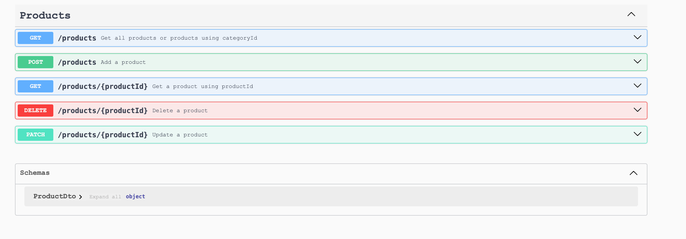

# Product Store API

A Spring Boot RESTful API for managing products

## Features

- **CRUD Operations**: Create, Read, Update, and Delete products
- **Rate Limiting**: Control request flow using Resilience4j
- **Caching**: Redis-based caching for improved read performance
- **Asynchronous Processing**: RabbitMQ message queue for event processing
- **Distributed Tracing**: Trace IDs for tracing request across services
- **Concurrency Control**: Redis-based locking mechanism for product updates


## Technologies

- **Framework**: Spring Boot 3
- **Database**: PostgreSQL (with Flyway migrations)
- **Caching**: Redis
- **Messaging**: RabbitMQ
- **Rate Limiting**: Resilience4j
- **Logging**: SLF4J with MDC for trace IDs
- **API Documentation**: OpenAPI 3 (Swagger UI)
- **Build Tool**: Maven
- **Other**: Lombok, MapStruct

## Helpful Links

- [Swagger UI](https://store-production-ca79.up.railway.app/swagger-ui/index.html#/)
- [Live Project](https://store-production-ca79.up.railway.app)

##### PostMan collection 
[](https://app.getpostman.com/run-collection/5283750-c6d12049-3be4-44ed-b124-0ef580d2d923?action=collection%2Ffork&source=rip_markdown&collection-url=entityId%3D5283750-c6d12049-3be4-44ed-b124-0ef580d2d923%26entityType%3Dcollection%26workspaceId%3D9ca7619c-09ab-49a2-86e0-f424b8ab5734#?env%5BProd%5D=W3sia2V5IjoiYmFzZVVybCIsInZhbHVlIjoiaHR0cHM6Ly9zdG9yZS1wcm9kdWN0aW9uLWNhNzkudXAucmFpbHdheS5hcHAiLCJlbmFibGVkIjp0cnVlLCJ0eXBlIjoiZGVmYXVsdCJ9XQ==)


## Getting Started

### Prerequisites

- Java 21+
- Maven 3.9+
- Redis
- RabbitMQ
- (Optional) PostgreSQL if not using H2

### Installation

1. Clone the repository and set up your .env file. Refer to .env-sample to see the required env variables:
   ```
   git clone https://github.com/Georgeygigz/store.git
   cd store
   mvn clean install
   mvn spring-boot:run
